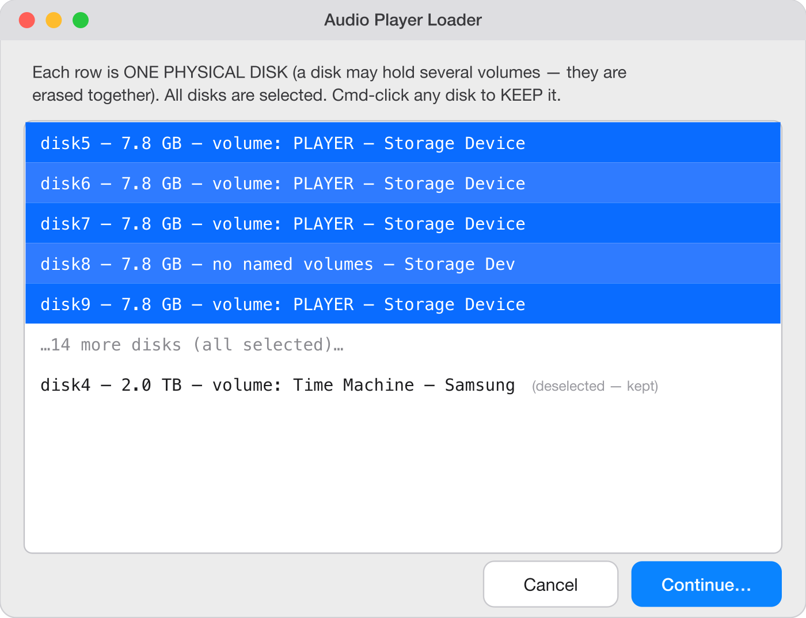
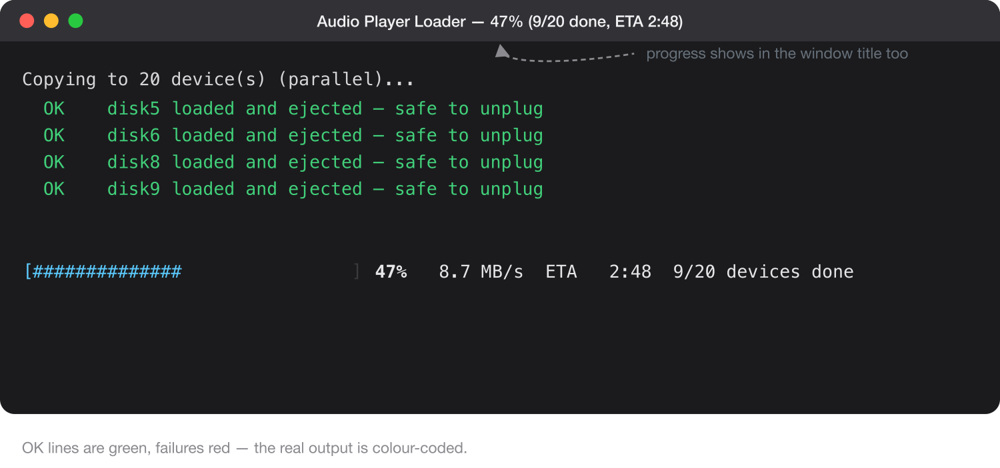

# Audio Player Loader

**The native macOS way to bulk-load audio content onto USB player devices — no Windows, no emulation, nothing to install.**

[](LICENSE.txt)
[](#requirements)
[](#requirements)

Audio Player Loader is a single macOS command-line script that erases a hub full of external USB audio players (MegaVoice-style devices, or anything that reads a FAT filesystem) and copies a folder of audio content onto all of them at once, in parallel. Non-technical operators run it by dragging the script onto Terminal — it drives native macOS dialogs from there.

The loaders for these players are almost all Windows programs; this is the **native-Mac alternative** — nothing to download, no emulation, no Windows. It uses only software that already ships on every Mac.

> ### 🎧 Just want to load some devices?
> You don't need this page. Follow the friendly, picture-by-picture **[Operator Guide →](https://rulingants.github.io/mac-audio-player-loader/)** instead. It walks through every step with screenshots.
>
> This README is for engineers, device manufacturers, and Mac users evaluating the tool.

> ### ⚠️ This tool erases whole disks
> For every device you select, it reformats the **entire physical disk** — every partition and every volume on it is wiped — before copying your content on. You choose exactly which disks are erased and confirm on-screen before anything happens, but there is no undo. Unplug any drive you want to keep, and read [How it works & safety](#how-it-works--safety) before running it on a machine with important disks attached.

---

## The gap it fills

The low-cost audio players used in field and ministry work — MegaVoice and similar FAT-based devices — have almost always been "programmed" with **Windows** software. On a Mac, that has meant running those Windows loaders through **Parallels, CrossOver (CodeWeavers), or Wine**: extra software to buy and set up, an emulation layer, and a workflow that is often clunky or flaky.

Those Windows tools are not broken — they work fine, on Windows. The problem has simply been that there was no good **native macOS** way to do the same job. That is the gap this tool fills.

Audio Player Loader is that native path. It uses **only what already ships on every Mac** — the built-in Terminal and bash, plus Apple's own `diskutil` and `rsync`. There is nothing to download, no emulation layer, and no Windows involved. Plug in a hub of devices, drag the script onto Terminal, and go. Parallels, CrossOver, and Wine become things you no longer need — not things you have to set up.



---

## What it does

- **Whole-disk erase with an explicit two-step confirmation.** A native list of the external disks (all preselected; Cmd-click to deselect ones to keep), then a distinct "ERASE these / KEEP these" summary whose default button is **Back**. Nothing is wiped without an on-screen confirmation that names each disk by size and volume.
- **Parallel erase and copy across every device at once.** Each device gets its own background worker, so wall-clock time is roughly the slowest single device — not the sum of them all.
- **Files copied in name order.** The copy uses `rsync`, which transfers its file list in sorted path order. On a freshly formatted volume the FAT directory entries are created in that same order, so minimal player firmware that reads files in directory order plays them in sequence. Numbered folders (`001 …`, `002 …`) are how you set the play order.
- **Scrubs macOS junk.** Suppresses Finder's `.DS_Store` writing for the run, then removes `.DS_Store` and `._*` AppleDouble sidecars that macOS forces onto FAT, leaving the content clean.
- **Blinks the LED of failed devices.** In the graphical run-again dialog, devices that failed have their light blinked (by forced writes) so you can physically find them in a crowded hub.
- **Renames failures to `REDO`.** Failed volumes are relabeled `REDO` and left connected, so they stand out in Finder and in the next run's list.
- **"Run again" for the next batch.** An end-of-run dialog offers to restart for a fresh batch or to redo just the failures — since successful devices are ejected, a re-run naturally shows only the ones still connected.
- **Always advises independent verification.** It cannot catch every failure (a device that fully lost power mid-copy can still be reported as loaded), so it always tells the operator to re-plug and check each device before handing it out.



---

## Requirements

- **macOS** — any Mac. It is a plain shell script, not a compiled binary, so it is **universal**: it runs natively on both Apple Silicon and Intel Macs, with nothing to build or match to your CPU. Developed and tested on macOS 26 "Tahoe", it uses only long-standing Apple tools and the system `bash` (3.2), so it should run on **macOS 10.13 High Sierra (2017) or later** with high confidence (and very likely back to 10.9 Mavericks).
- **A powered USB hub and the player devices** you want to load. A powered hub matters — bus power alone rarely drives many devices at once.
- **Dependencies: none.** Nothing to install: no Homebrew, no third-party binaries, no downloads at runtime. No `sudo` and no root.

---

## Get it / Quick start

**Download the ready-to-run bundle** (recommended for operators):

➡️ **[Download the latest macOS release](https://github.com/rulingAnts/mac-audio-player-loader/releases/latest/download/audio-player-loader-macOS.zip)**

**…or clone the repository:**

```sh
git clone https://github.com/rulingAnts/mac-audio-player-loader.git
```

Then:

1. Put `load_content.sh` **inside your content folder**, next to your numbered audio folders — the loader copies whatever sits in its own folder (see [Preparing your content](#preparing-your-content)).
2. Plug in your powered USB hub with the devices.
3. Open **Terminal** (Cmd + Space, type `terminal`, Return).
4. Type `bash ` (the word `bash` followed by a space) — **do not press Return yet**.
5. **Drag the `load_content.sh` that is inside your content folder onto the Terminal window** — that copy, beside your audio, is the one that decides what gets loaded. Its path fills in after `bash`.
6. Press **Return** and follow the dialogs: name the batch's volume label, pick the disks to erase, confirm, and watch the progress bar.

For the full picture walkthrough — including what to do if you can't drop the file onto the Terminal window — send operators to the **[Operator Guide](https://rulingants.github.io/mac-audio-player-loader/)**.

---

## Preparing your content

The script lives **inside** the content folder and copies that folder to each device. Set it up like this:

```
My Content Folder/
├── load_content.sh          ← the script
├── 001 Introduction/
│   ├── 001 track one.mp3
│   └── 002 track two.mp3
├── 002 Gospel of Mark/
│   └── …
└── 003 Songs/
    └── …
```

- **Put your numbered folders next to `load_content.sh`.** The numbering **is** the play order: files land on the device in sorted name order, and minimal player firmware plays them in that order.
- **The script copies everything in its own folder except its helper files.** It automatically excludes itself and any `*.app`, `*.zip`, `*.cmd` / `*.CMD`, `*.txt` / `*.TXT`, `*.md`, `*.html`, and an `images/` folder — so the script, its docs, this README, and screenshot folders never get copied onto the devices. macOS junk (`.DS_Store`, `._*`, and similar) is excluded too.

---

## Compatible players

This loader is **player-agnostic**: it makes one clean, full-size FAT32 volume on each device you select and copies your numbered folders onto it in play order. It doesn't care what brand the player is — it cares that the player can read what it writes. The author is actively expanding the tested list; a player that isn't listed as tested will very likely still work once your source folder is set up the way that player expects. As a rule of thumb, this tool is expected to load essentially any device **SaberCopy** (the GRN/MegaVoice loader) can load.

**Will my player work? — the four-point checklist:**

1. **Removable storage** — the player mounts as a USB drive, *or* it has a removable microSD/SD card you can load in a card reader.
2. **FAT32** — it reads a FAT32 volume (nearly all simple players do).
3. **Plain files** — it plays unencrypted audio (normally MP3) dropped into folders, not a locked container built by the maker's own software.
4. **Predictable order** — it plays by name-sort or by copy order, so numbered folders and tracks come out in sequence.

The one genuine hard limit: a player that exposes *no* removable card *and* *no* USB drive mode gives a drive-based loader nothing to write to — load those with the maker's own software.

**Researched player families:** KULUMI / Hope Tech Global (Mini — **tested & verified**; X; Sheep), MegaVoice (Companion/Shield, Herald, Envoy 2, Envision), Renew World Outreach (The Torch), Faith Comes By Hearing (Proclaimer, BibleStick, Micro Proclaimer), GRN Saber, and generic FAT MP3 players / USB-SD radios.

For per-device folder structure, cabling, filesystem, audio format, and links to each manufacturer's own loading documentation, see the **Player-Specific Setup** tab of the [operator guide](https://rulingants.github.io/mac-audio-player-loader/).

---

## How it works & safety

Each run proceeds top-to-bottom through a short sequence of phases; the erase and copy phases fan out one background worker per device for speed:

1. **Label prompt** — ask for the FAT volume label (default `PLAYER`; sanitized to letters/digits, uppercased, ≤ 11 chars; `REDO` is reserved).
2. **Resolve the source disk** — figure out which physical disk holds the content folder so it can be protected.
3. **Enumerate targets** — list external *physical* disks, skipping the source disk and any write-protected media; capture each disk's exact byte size.
4. **Pick & confirm** — the two-dialog picker + "ERASE / KEEP" summary.
5. **Erase (parallel)** — re-verify each disk's identity, then `diskutil eraseDisk FAT32 <LABEL> MBRFormat`, with one retry.
6. **Prepare** — mount each fresh volume and confirm it is really ours.
7. **Copy (parallel)** — `rsync` the content, scrub macOS junk, eject.
8. **Progress** — the main process polls per-device status files to draw a live bar and detect stalls.
9. **Results** — bucket every device into **OK / CHECK / REDO**, relabel failures, print a summary and verification advice.
10. **Run again** — offer to re-run for the next batch.

The safety guards that make it trustworthy to run:

- **Never erases the source disk.** It walks the content folder back to its physical disk(s) — through APFS synthesized-to-physical mapping — and excludes them from the target list.
- **Skips write-protected media.** Hardware-locked cards (e.g. a MegaVoice CSD write-protect) are detected and skipped rather than failing confusingly mid-run.
- **Two-step human confirmation.** You see exactly what will be wiped, by size and volume name, and the summary dialog defaults to **Back**.
- **Re-verifies disk identity right before erasing.** macOS reuses `diskN` numbers; immediately before each erase the script re-checks that the disk's exact byte size still matches and it is still external + physical, so a device swapped while the dialog was open can't misdirect the erase.
- **Only copies to a correctly-formatted volume on the right device node.** After erasing, it copies only to a volume that carries the chosen label *and* resolves to the expected `/dev/diskNs1`; and before/after each `rsync` it re-confirms the mount still points at that device — so if a device vanishes and macOS leaves a stray `/Volumes/<name>` folder on the boot disk, nothing gets written to the internal drive.
- **Stall timeout.** A copy with zero write progress for 300 seconds is killed and marked `REDO`, so one dying device can't wedge the whole batch.
- **Restores the one host setting it toggles.** It temporarily disables Finder's `.DS_Store`-on-USB writing during the run and puts the original value back on exit — your Mac is left exactly as it was found.

This is a condensed summary. For the complete guard-by-guard table, the reasoning behind each guard, and the auditing notes, read the **[full technical specification →](https://rulingants.github.io/mac-audio-player-loader/TECHNICAL.html)** (also in this repo as [`TECHNICAL.html`](TECHNICAL.html)).

---

## Performance

Loading is much faster than imaging a device with `dd` or Balena Etcher, for two compounding reasons:

- **Only the real files are copied.** `rsync` moves just your actual content — not a whole-disk image and its empty slack — and there is no read-back verification pass. Restoring an image typically writes the entire image *and reads it all back* to validate; copying the files skips both.
- **Every device runs in parallel.** Erase and copy fan out across all devices at once, so total time is roughly the slowest single device, not the sum. (Spotlight indexing is also held off each freshly-mounted volume so it doesn't contend for the device's limited I/O mid-write.)

In practice the remaining bottleneck is shared USB-hub bandwidth, not the Mac or the tool — spreading devices across multiple hubs on separate ports raises the ceiling further. Keeping your content on the Mac's internal SSD helps too: it reads far faster than any USB source device and never competes with the USB writes, so a USB-hosted source — even on a separate port — can itself become the bottleneck.

---

## Privacy

- **No network connections.** The script makes no network calls — no telemetry, analytics, or update checks; nothing is downloaded or phoned home. (The only URL anywhere in the file is the GNU license address in the header comment, which is never contacted.)
- **Reads the Mac's computer name only for display.** It reads the computer name (`scutil --get ComputerName`) solely to reference it in on-screen guidance; nothing else is read from the host.
- **Does not modify your source folder.** It reads the content folder and writes only to the external devices you select.
- **Restores the one host setting it changes.** The only host setting it touches is the Finder `.DS_Store`-on-USB default, captured before the run and restored on exit. It also disables Spotlight indexing per target volume (`mdutil -i off`), which is not a host setting: the only artifact that leaves lives on the device, which is wiped the next time that device is erased.

---

## Rebranding

The script is generic on purpose — it works with any player whose content folder has the right structure. The `APP_TITLE` variable at the very top of `load_content.sh` sets the name shown in **every** dialog, notification, and the Terminal title:

```sh
APP_TITLE="Audio Player Loader"
```

Change that one line to your own product name and ship it. **Device manufacturers are explicitly welcome to rebrand and distribute this** for their own players. The AGPL-3.0 terms still apply: your rebranded version must remain open source under the same license and keep the original copyright notice alongside your own (see [License](#license)).

---

## License

**Audio Player Loader is licensed under the GNU Affero General Public License, version 3.0 (AGPL-3.0).**
Copyright © 2026 Seth Johnston.

In plain terms: you are free to use, study, modify, and redistribute the script — including on your own website and for your own devices and content, at no cost and without asking permission. If you distribute it or a modified version, it must stay under AGPL-3.0 with the complete source available to whoever receives it, and you must preserve the copyright and license notices. Because it is the *Affero* GPL, that source-availability obligation extends to letting people use a modified version over a network. There is no warranty. The full, authoritative terms are in [`LICENSE.txt`](LICENSE.txt); the summary here is plain-language guidance, not legal advice.

---

## Credits

The convention at the heart of this tool — a loader script that **lives inside the content folder** and copies that folder onto each device — is modeled on **Hope Tech Global's `HTGv4.CMD`** Windows workflow. This is a native-macOS reimagining of that idea, gratefully credited to Hope Tech Global. Their file is **not** bundled with this project; only the workflow convention is borrowed.
